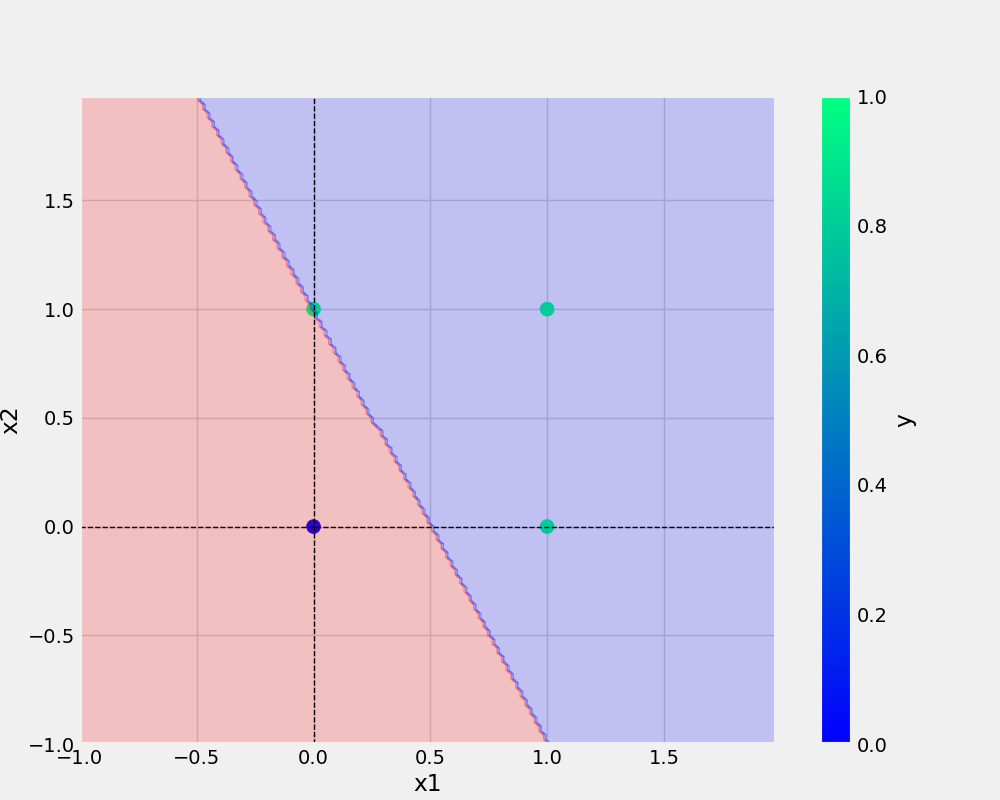

# oneNeuron
oneNeuron | perceptron


```bash
git add . && git commit -m "mesggage" && git push origin main

```

```bash
cp Research\ notebooks/demo.ipynb

```

## Add URL -
[Git Handbook](https://guides.github.com/introduction/git-handbook)

## Add Image -
