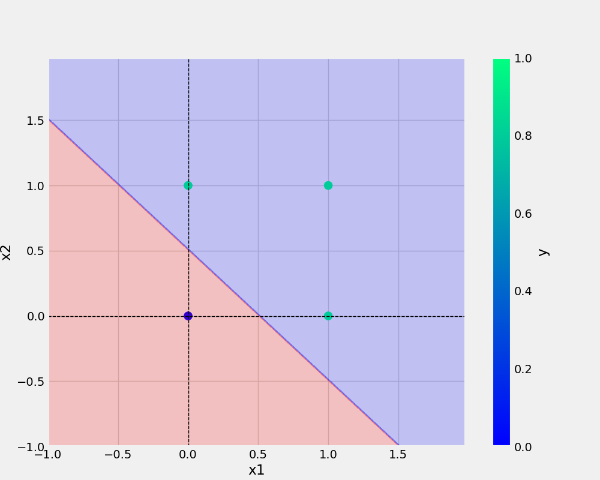

# oneNeuron
oneNeuron | perceptron


```bash
git add . && git commit -m "message" && git push origin main

```

```bash
cp Research\ notebooks/demo.ipynb

```

## Add URL -
[Git Handbook](https://guides.github.com/introduction/git-handbook)


## Add Image -



## AND Dataset -
x1 | x2 | y1 
-|-|-
0|0|0 
0|1|0 
1|0|0
1|1|1 


